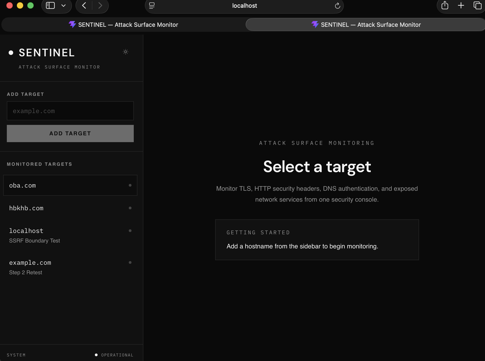
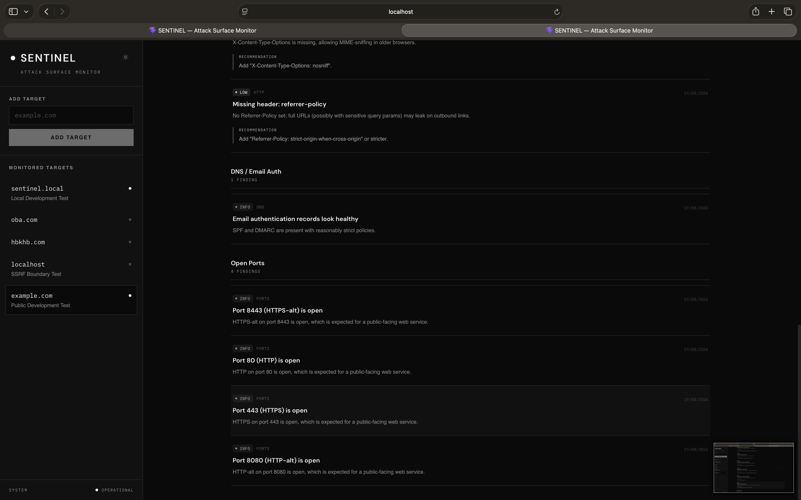
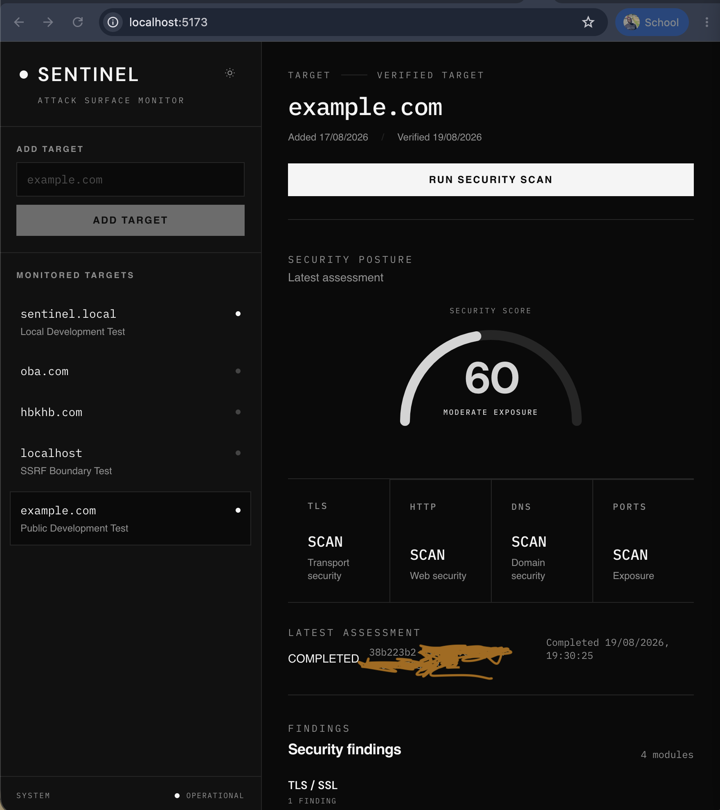

# Sentinel

Sentinel is a security scanning and risk assessment platform designed to help identify, analyze, and prioritize security issues affecting internet-facing targets.

The platform combines automated reconnaissance, security checks, risk scoring, ownership validation, and scan event tracking into a single workflow.

## Overview

Sentinel is designed around a simple security assessment workflow:

**Target → Validation → Scan Queue → Security Scanners → Findings → Risk Scoring → Database → Dashboard**

The goal is to provide security teams and developers with a structured way to perform authorized security assessments and understand the security posture of their targets.

## Key Capabilities

* DNS reconnaissance
* HTTP security analysis
* Port scanning
* TLS configuration analysis
* Risk scoring
* Target ownership validation
* SSRF protection
* Request rate limiting
* Background scan workers
* Scan event tracking
* PostgreSQL persistence
* REST API
* React-based security dashboard
* Risk visualization
* Severity indicators
* Scan detail views
* Target verification workflow
* Theme support
* Docker-based local development

## Architecture

```text
                         ┌──────────────────────┐
                         │      React UI        │
                         │      Dashboard       │
                         └──────────┬───────────┘
                                    │
                                    │ REST API
                                    ▼
                         ┌──────────────────────┐
                         │     Sentinel API     │
                         │                      │
                         │ Targets / Scans      │
                         └──────────┬───────────┘
                                    │
                                    ▼
                    ┌──────────────────────────────┐
                    │       Security Layer         │
                    │                              │
                    │ SSRF Protection              │
                    │ Ownership Validation         │
                    │ Rate Limiting                │
                    └──────────────┬───────────────┘
                                   │
                                   ▼
                         ┌──────────────────────┐
                         │     Scan Queue       │
                         └──────────┬───────────┘
                                    │
                                    ▼
                         ┌──────────────────────┐
                         │   Background Workers │
                         └──────────┬───────────┘
                                    │
             ┌──────────────────────┼──────────────────────┐
             │                      │                      │
             ▼                      ▼                      ▼
       ┌───────────┐          ┌───────────┐          ┌───────────┐
       │    DNS    │          │   HTTP    │          │   Ports   │
       │  Scanner  │          │  Scanner  │          │  Scanner  │
       └───────────┘          └───────────┘          └───────────┘
                                    │
                                    ▼
                             ┌───────────┐
                             │    TLS    │
                             │  Scanner  │
                             └─────┬─────┘
                                   │
                                   ▼
                           ┌───────────────┐
                           │  Risk Scoring │
                           └───────┬───────┘
                                   │
                    ┌──────────────┼──────────────┐
                    │                             │
                    ▼                             ▼
             ┌──────────────┐             ┌──────────────┐
             │ Scan Events  │             │  PostgreSQL  │
             └──────────────┘             └──────────────┘
```

## Screenshots


```text
docs/
└── screenshots/
    ├── dashboard.png
    ├── scan-detail.png
    └── verification.png
```

### Security Dashboard



### Scan Details



### Target Verification



## How Sentinel Works

### 1. Target Submission

A user submits a target for security assessment through the Sentinel dashboard.

The target is passed to the backend API for validation before scanning begins.

### 2. Security Validation

Sentinel applies security controls before allowing a scan to proceed.

These controls include:

* Target ownership validation
* SSRF protection
* Rate limiting
* Input validation

This helps prevent the scanning infrastructure from being abused against unauthorized or internal resources.

### 3. Scan Queue

Validated scans are placed into the scanning workflow.

Background workers process the scan independently from the API layer.

### 4. Security Scanning

The scanning pipeline can perform multiple types of analysis:

* DNS reconnaissance
* HTTP security checks
* Port scanning
* TLS analysis

Each scanner produces findings that can be processed by the risk scoring system.

### 5. Risk Scoring

Security findings are evaluated and combined into an overall risk assessment.

The purpose of the risk score is to provide a simple way to understand the relative security impact of discovered findings.

### 6. Persistence

Scan information, findings, and related events are stored in PostgreSQL.

This allows Sentinel to maintain scan history and provide information to the dashboard.

### 7. Dashboard

The React frontend consumes the backend REST API and presents scan information through:

* Risk indicators
* Severity badges
* Scan details
* Verification information
* Scan status
* Security findings

## Technology Stack

### Frontend

* React
* TypeScript
* Vite
* Tailwind CSS

### Backend

* Node.js
* TypeScript
* REST API

### Database

* PostgreSQL

### Infrastructure

* Docker
* Docker Compose

## Project Structure

```text
sentinel/
│
├── backend/
│   ├── src/
│   │   ├── api/
│   │   │   ├── scans.ts
│   │   │   └── targets.ts
│   │   │
│   │   ├── db/
│   │   │   ├── migrate.ts
│   │   │   ├── pool.ts
│   │   │   └── schema.sql
│   │   │
│   │   ├── lib/
│   │   │   ├── queue.ts
│   │   │   ├── scanEvents.ts
│   │   │   └── security/
│   │   │       ├── ownership.ts
│   │   │       ├── rateLimit.ts
│   │   │       └── ssrf.ts
│   │   │
│   │   ├── scanners/
│   │   │   ├── dns.ts
│   │   │   ├── http.ts
│   │   │   ├── ports.ts
│   │   │   ├── riskScore.ts
│   │   │   └── tls.ts
│   │   │
│   │   ├── types/
│   │   │   └── index.ts
│   │   │
│   │   ├── workers/
│   │   │   └── index.ts
│   │   │
│   │   └── server.ts
│   │
│   └── package.json
│
├── frontend/
│   ├── src/
│   │   ├── components/
│   │   │   ├── RiskGauge.tsx
│   │   │   ├── ScanDetail.tsx
│   │   │   ├── SeverityBadge.tsx
│   │   │   ├── Sidebar.tsx
│   │   │   ├── ThemeToggle.tsx
│   │   │   └── VerificationPanel.tsx
│   │   │
│   │   ├── lib/
│   │   │   ├── api.ts
│   │   │   └── theme.ts
│   │   │
│   │   ├── styles/
│   │   │   └── global.css
│   │   │
│   │   ├── App.tsx
│   │   └── main.tsx
│   │
│   └── package.json
│
├── docker-compose.yml
├── .gitignore
└── README.md
```

## Security Architecture

Security is treated as a core part of the scanning workflow rather than an additional feature.

### SSRF Protection

Sentinel includes SSRF protection to help prevent scan requests from being redirected toward private, internal, or otherwise restricted network resources.

### Ownership Validation

Targets are subject to ownership validation before scanning.

This is intended to ensure that Sentinel is used for authorized security assessments rather than arbitrary third-party scanning.

### Rate Limiting

Rate limiting helps control API and scanning activity and reduces the possibility of excessive requests against a target.

### Background Workers

Scanning tasks are processed through background workers rather than requiring the API request itself to perform the entire scanning operation.

This allows the application to separate request handling from potentially longer-running security operations.

## API Documentation

The backend exposes REST API endpoints for managing targets and scans.

The primary API implementation is located in:

```text
backend/src/api/targets.ts
backend/src/api/scans.ts
backend/src/server.ts
```

### Targets

Target-related operations are handled by the targets API.

Typical target workflow:

```text
Create Target
     ↓
Validate Target
     ↓
Verify Ownership
     ↓
Target Available for Scanning
```

The target API is responsible for receiving and processing target information before it enters the scanning workflow.

### Scans

Scan-related operations are handled by:

```text
backend/src/api/scans.ts
```

The scan workflow connects the API layer with the scanning workers.

```text
API Request
    ↓
Validation
    ↓
Queue
    ↓
Worker
    ↓
Scanners
    ↓
Risk Score
    ↓
Results
```

### Scan Events

Sentinel also tracks scan events through the scan event system.

This provides visibility into the progression of scanning operations and can be used to support scan status and activity information in the frontend.

## Database

Sentinel uses PostgreSQL for persistent application data.

The database schema is located at:

```text
backend/src/db/schema.sql
```

Database connectivity and migrations are handled through:

```text
backend/src/db/pool.ts
backend/src/db/migrate.ts
```

## Configuration

Environment-specific configuration is kept outside source control.

The backend includes an example environment file:

```text
backend/.env.example
```

Local secrets should be stored in:

```text
backend/.env
```

The `.env` file is excluded from Git to prevent credentials and environment-specific secrets from being committed.

## Local Development

Clone the repository and enter the project directory:

```bash
git clone https://github.com/GabrielOboko/sentinel.git
cd sentinel
```

### Backend

```bash
cd backend
npm install
```

Configure the required environment variables using:

```text
backend/.env.example
```

### Frontend

Open another terminal:

```bash
cd frontend
npm install
```

Start the frontend development server using the package script configured in `frontend/package.json`.

### Docker

Sentinel also includes a Docker Compose configuration:

```text
docker-compose.yml
```

This can be used to support the local application infrastructure.

## Responsible Scanning

Sentinel should only be used to scan systems and infrastructure that you own or have explicit authorization to assess.

Unauthorized scanning can cause operational impact and may violate organizational policies or applicable laws.

Always confirm authorization and scope before starting a scan.

## Development Principles

Sentinel is being developed around several principles:

* Security by design
* Explicit target authorization
* Separation of API and scanning workloads
* Modular scanners
* Persistent scan history
* Clear risk communication
* Maintainable TypeScript code
* Responsible security testing

## Roadmap

Potential future development areas include:

* Expanded vulnerability detection
* Additional security scanners
* Improved scan history
* Advanced reporting
* Exportable security reports
* Authentication and authorization
* Role-based access control
* More detailed finding explanations
* Expanded API documentation
* Automated testing
* CI/CD integration
* Production deployment support

## Project Status

Sentinel is an actively developed security scanning and risk assessment platform.

The current implementation establishes the core application architecture, security controls, scanning pipeline, risk scoring, persistence layer, and frontend dashboard.

## License

License information will be added as the project licensing decision is finalized.
